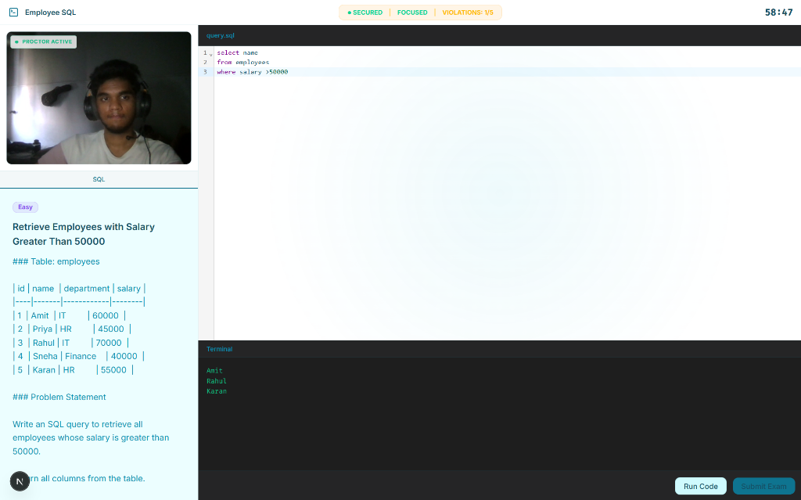
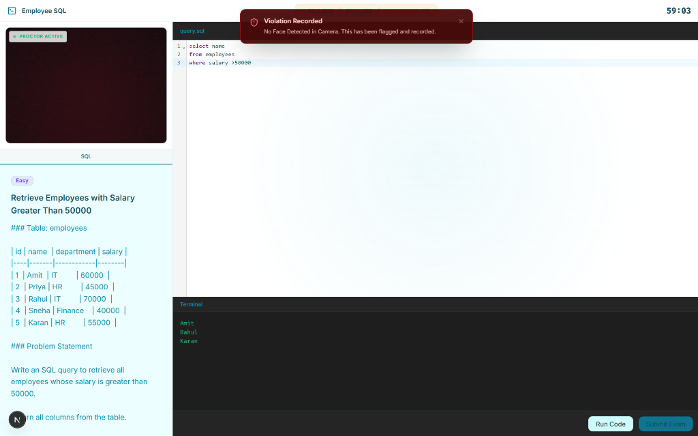
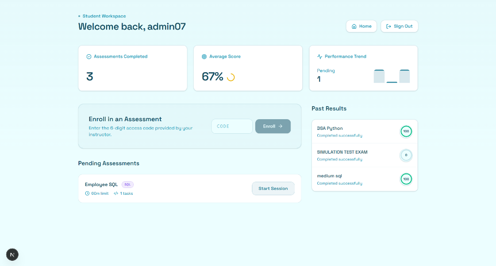
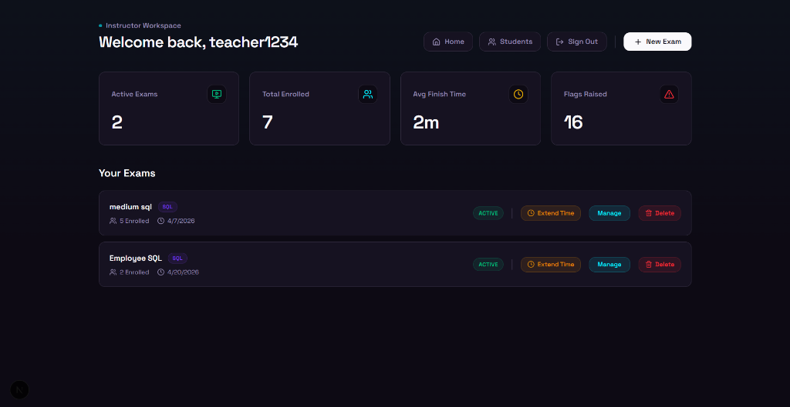
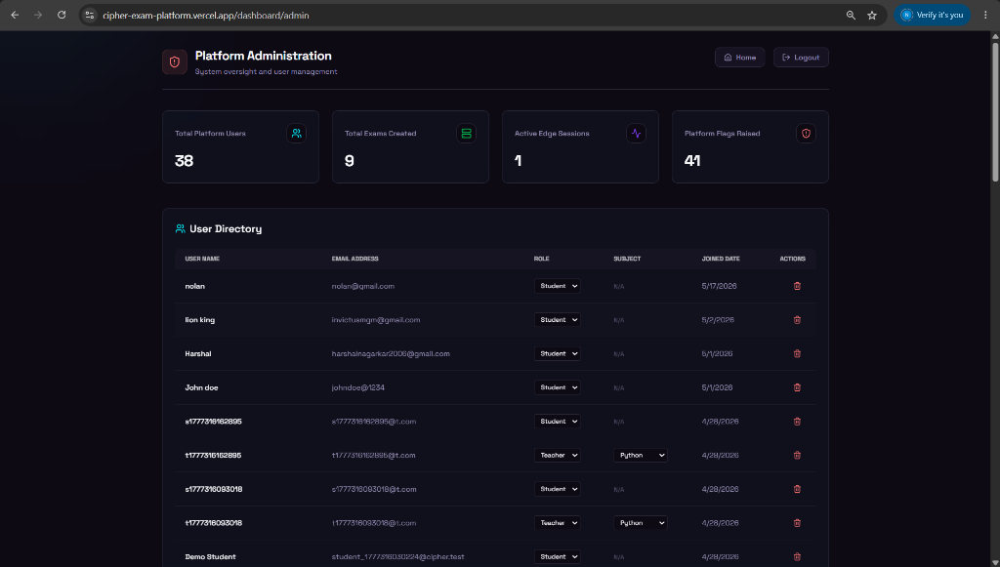

# Cipher - AI-Powered Proctored Coding Exam Platform

[🌍 **View Live Demo**](https://cipher-exam-platform.vercel.app/)

> **🚀 Live Demo Note:** 
> This application is deployed using the free tiers of Vercel (Frontend) and Render (Backend). Because Render spins down inactive instances to conserve resources, the initial API request (like logging in) may take up to **50 seconds** as the server cold-starts. Subsequent requests will be lightning fast!

## 📸 Platform Previews

<div align="center">
  
  
  
  
  
</div>

## 🌟 Overview
Cipher is a next-generation, secure, and AI-powered coding assessment platform designed to ensure fair and tamper-proof technical examinations. It features real-time code execution, AI-driven face verification, and a robust anti-cheat proctoring system.

## 🚀 Key Features
- **Secure Code Execution:** Isolated Docker-based environment for safe compilation and execution of student code.
- **AI Face Verification:** Zero-knowledge face verification to ensure the authenticity of the test taker.
- **Advanced Proctoring:** Real-time behavioral analytics, tab-switch monitoring, full-screen enforcement, and multiple-face detection.
- **Role-Based Dashboards:** Dedicated interfaces for Students (taking exams), Teachers (creating/monitoring exams), and Admins (system oversight).
- **Auto-Grading:** Instant evaluation of code submissions against predefined test cases.

## 💻 Tech Stack
- **Frontend:** Next.js, React, Tailwind CSS, Framer Motion
- **Backend:** Node.js, Express, Socket.io
- **Database:** MongoDB
- **AI Models:** face-api.js (TensorFlow.js)

## 🛠️ Local Setup & Installation

To run this project locally, follow these steps:

### 1. Clone the repository
```bash
git clone https://github.com/AtharvaKesare/cipher-exam-platform.git
cd cipher-exam-platform
```

### 2. Backend Setup
```bash
cd backend
npm install
```
Create a `.env` file in the `backend` directory with the following variables:
```env
PORT=5000
MONGO_URI=your_mongodb_connection_string
JWT_SECRET=your_super_secret_jwt_key
FRONTEND_URL=http://localhost:3000
```
Start the backend server:
```bash
npm start
```

### 3. Frontend Setup
Open a new terminal and navigate to the frontend directory:
```bash
cd frontend
npm install
```
Create a `.env.local` file in the `frontend` directory:
```env
NEXT_PUBLIC_API_URL=http://localhost:5000
```
Start the frontend development server:
```bash
npm run dev
```

## 🏗️ System Architecture & Design
This project was built with a strong focus on scalable system design. You can view our architectural blueprints and UML diagrams in the root directory:
- [System Blueprint (Markdown)](./PROJECT_BLUEPRINT.md)
- [UML Diagrams](./cipher_uml_diagrams.md)
