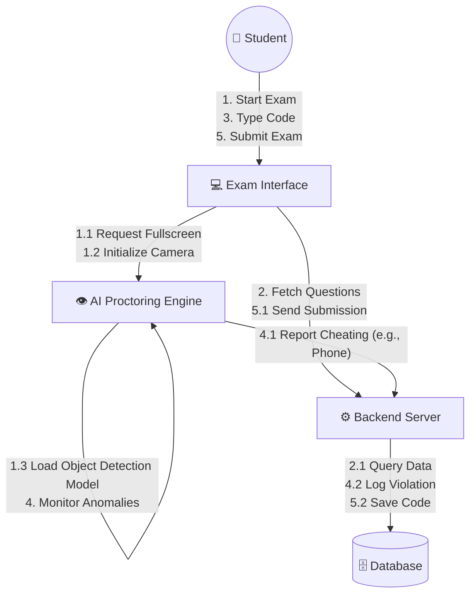
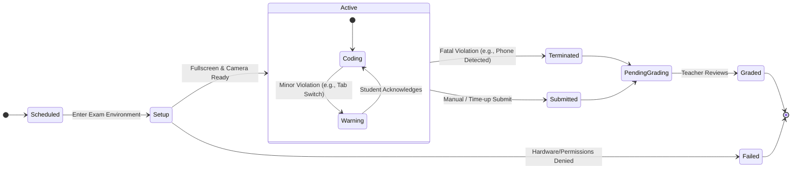
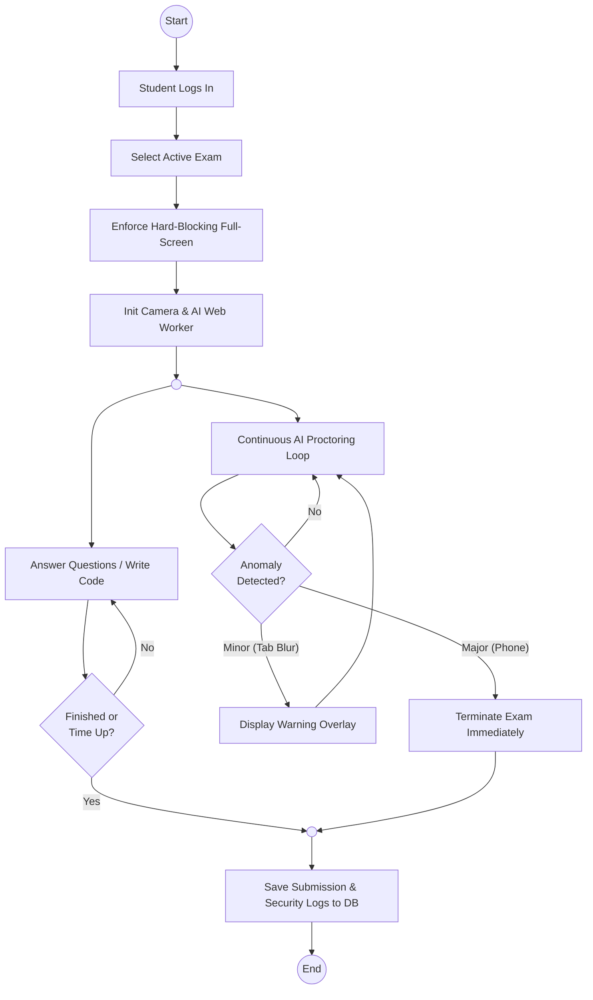

# Cipher Platform UML Diagrams

This document contains key UML diagrams that illustrate the system behavior, state transitions, and object interactions for the **Cipher AI-Powered Proctored Coding Exam Platform**.

## 1. Collaboration Diagram (Communication Diagram)

The collaboration diagram models the interactions and messages passed between different system components during an active exam session.

## 2. State Chart Diagram

The state chart outlines the lifecycle of an exam session from the student's perspective, emphasizing the strict security states and termination triggers.

## 3. Activity Diagram

The activity diagram maps the concurrent processes occurring during an exam: the student completing their work and the background AI continuously monitoring for academic dishonesty.

